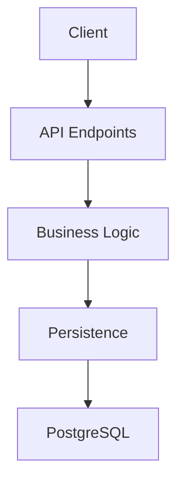
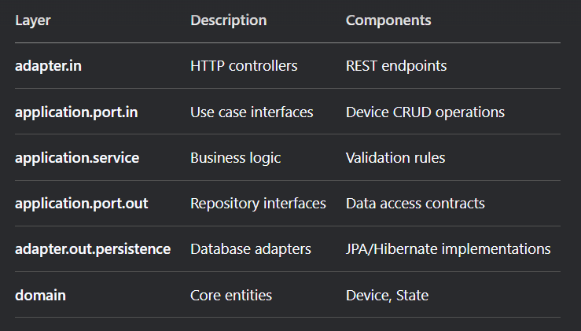
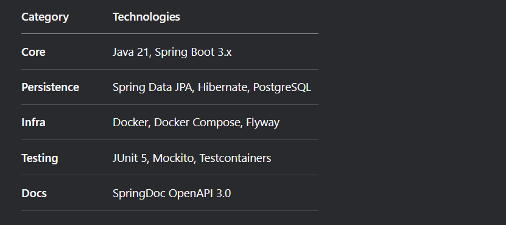

# 📱 Devices API - 1GLOBAL Challenge

## 🌟 Overview

This project implements a RESTful API for device resources management, as per the [1GLOBAL challenge specifications](https://github.com/1GLOBAL-HRM/challenge). The API provides comprehensive CRUD operations for device resources with advanced filtering capabilities.

##  🏗️  Architectural Pattern
Clean Architecture with Ports & Adapters

## 🚀 Features

## 📋 Core Operations

- ### ✅ Create new devices

- ### 🔍 Retrieve devices (single or paginated list)

- ### ✏️ Full & partial updates

- ### 🗑️ Delete devices (with state validation)

## 🔎 Advanced Filtering

- ### 🔧 Filter by brand (/devices?brand=Apple)

- ### 🏷️ Filter by state (/devices?state=AVAILABLE)

- ### 📄 Pagination support (/devices?page=0&size=10)

## 🛡️ Business Rules

- ### 📅 Device state validation on updates
  - Devices can only be deleted if they are not in the IN_USE state.
  - Devices' name or brand can only be updated if the device are not in the IN_USE state.
  - Device totally updated is possible for any state, however, name and brand parameter cannot be null or empty.
  - To create a new device, the name and brand parameters cannot be null or empty.

## 🛠️ Tech Stack

# 🚀 Quick Start
### Prerequisites

- ### 🐳 Docker Desktop (or Docker Engine + Compose)

- ### ☕ Java 21+ JDK

## Running with Docker Compose

## 1. Clone the repository

### git clone https://github.com/gibranmenezes/1global-devices.git
### cd one-global-api

## 2. Start the system
### docker-compose up -d

## 3. Verify containers
### docker ps -a

# 4. Access services:

| Service             | 	       URL                                            |  
|---------------------|--------------------------------------------------------|
| API	                | http://localhost:8080/global-api                       |
|---------------------| --------------------------------------------------     |
| Swagger UI	     | http://localhost:8080/global-api/swagger-ui.html       |
|---------------------| --------------------------------------------------     |
| Adminer (DB UI) | 	     http://localhost:8081                            |
|---------------------| --------------------------------------------------     |

## 5. Stop containers
### docker-compose down

## 🤝 Contributing

1. Fork the project

2. Create your feature branch (git checkout -b feature/amazing-feature)

3. Commit your changes (git commit -m 'Add some amazing feature')

4. Push to the branch (git push origin feature/amazing-feature)

5. Open a Pull Request

## 📄 License
Distributed under the MIT License. See LICENSE for more information.

